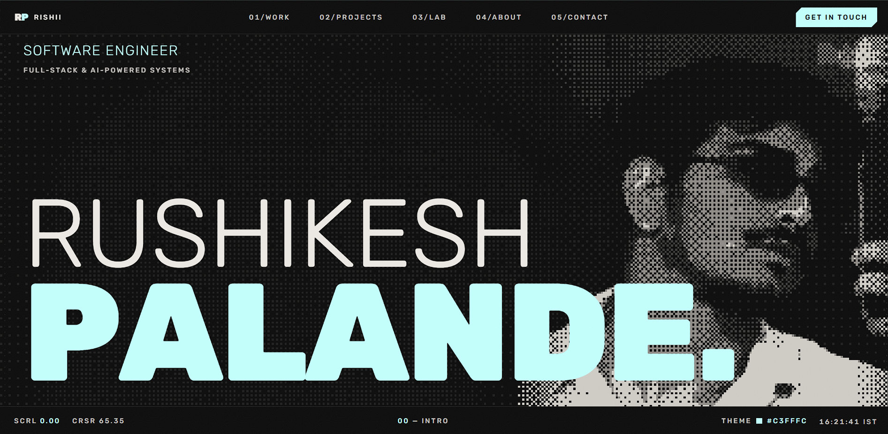
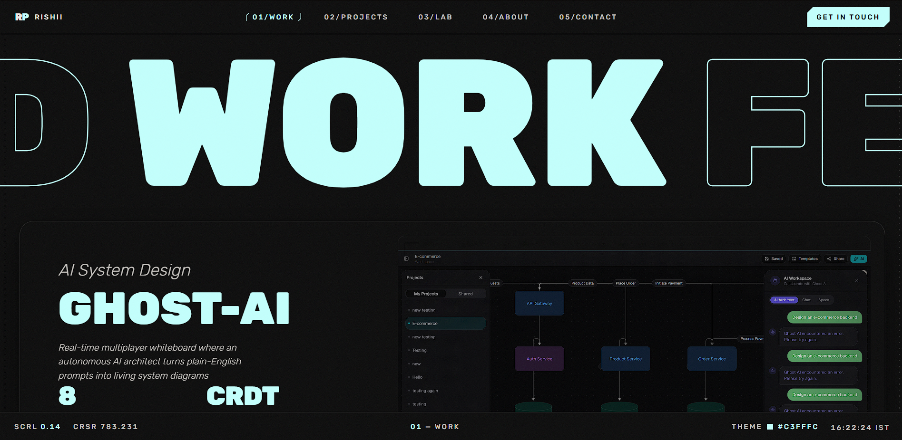
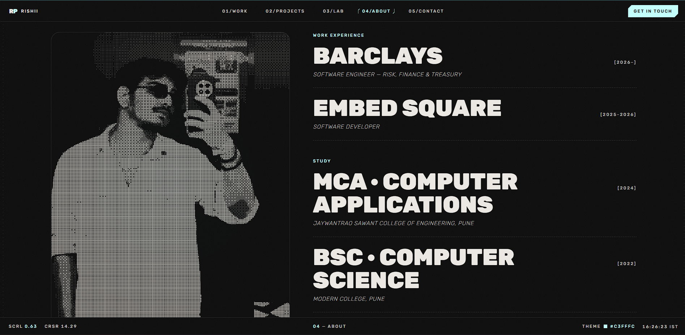

<div align="center">



<br />

<h1>Rushikesh Palande — Portfolio</h1>

<p>
  <b>Software Engineer</b> · Full-Stack &amp; AI-Powered Systems<br />
  A dark, editorial site built as a design system first, then composed into pages.
</p>

<p>
  <a href="https://rishii-two.vercel.app/"></a>
  
  
  
  
  
</p>

</div>

<br />

Oversized display typography, mono microlabels, live scroll/cursor telemetry, a canvas-dithered portrait rendered pixel-by-pixel in the browser, and a full case-study page behind every project card — nine of them, each written from the shipped repository, not boilerplate copy.

## Preview

<table>
<tr>
<td width="50%">
  
  <p align="center"><sub><b>01 · Featured Work</b> — sticky-stacked case-study deck</sub></p>
</td>
<td width="50%">
  
  <p align="center"><sub><b>04 · About</b> — canvas-dithered portrait, career ledger</sub></p>
</td>
</tr>
</table>

## Features

- **Nine real case studies**, each with its own route, own SEO title/description, and copy sourced from the actual repo — no lorem ipsum
- **Canvas-rendered portrait art** — an ordered (Bayer) dither run client-side against the profile photo, no pre-baked image asset, contrast-tuned per breakpoint
- **Live HUD chrome** — scroll-progress and cursor-position readouts, an accent-color cycler, a real-time clock, all updated every frame
- **Scramble-decode text** on the boot sequence and section titles, staggered reveal timed to the preloader's exit
- **Perpetual marquee headlines** that drift on their own and pick up momentum from scroll, never fully stopping
- **Prerendered routes** — all 10 pages (home + 9 case studies) are statically generated at build time for instant paint and full crawlability
- **Reduced-motion aware** throughout; every animation has a static fallback

## Tech stack

| Layer | Choice |
| --- | --- |
| Framework | React 19 + Vite 7 |
| Language | TypeScript (strict) |
| Routing | React Router 7 — prerendered at build time |
| Styling | Tailwind CSS v4 (CSS-first `@theme`, no config file) |
| Motion | Framer Motion · Lenis smooth scroll |
| Type | Rubik Variable, self-hosted |
| Icons | simple-icons (tree-shaken, inline SVG) |
| Quality | ESLint 9 flat config · `tsc --noEmit` · production build gate |

## Getting started

```bash
npm install
npm run dev        # dev server
npm run lint        # ESLint
npm run typecheck   # tsc --noEmit
npm run build        # type-check + production build + prerender
npm run preview      # preview the prerendered build
```

## Routes

| Path | Renders |
| --- | --- |
| `/` | Hero · Tech band · Work · Projects · Lab · About · Contact |
| `/work/:slug` | Featured-work case studies — `ghost-ai` · `echo` · `nodebase` |
| `/projects/:slug` | More-project case studies — `roomify` · `nimbus` · `apple-macbook` · `sendkit` · `zenbrew` · `fizzie` |

## Project documentation

Every decision behind this build is written down in [`docs/`](docs/) as it was made:

| Doc | Purpose |
| --- | --- |
| [01-project-plan.md](docs/01-project-plan.md) | Goals, decisions, milestones, open items |
| [02-design-spec.md](docs/02-design-spec.md) | Design system — tokens, type scale, motion, structure |
| [03-content-map.md](docs/03-content-map.md) | All site copy and its sources |
| [04-architecture.md](docs/04-architecture.md) | Stack, folder structure, conventions |
| [05-seo-strategy.md](docs/05-seo-strategy.md) | SEO implementation & indexing checklist |
| [06-changelog.md](docs/06-changelog.md) | Chronological project log |

## SEO

Every route ships its own `<title>` and meta description (prerendered, not client-patched), a `Person` + `WebSite` + `ProfilePage` JSON-LD graph, Open Graph and Twitter cards, a 10-URL `sitemap.xml`, and a permissive `robots.txt`. Full detail in [`docs/05-seo-strategy.md`](docs/05-seo-strategy.md).

## Git workflow

- `main` — production releases only
- `develop` — integration branch
- `feature/*` / `fix/*` — one branch per change, merged into `develop` via PR
- Releases: `develop` → `main`

## Connect

[rishikeshx1006@gmail.com](mailto:rishikeshx1006@gmail.com) · [LinkedIn](https://www.linkedin.com/in/rushikesh07) · [GitHub](https://github.com/RISHII7)

<sub>© 2026 Rushikesh Palande. Licensed under MIT.</sub>
